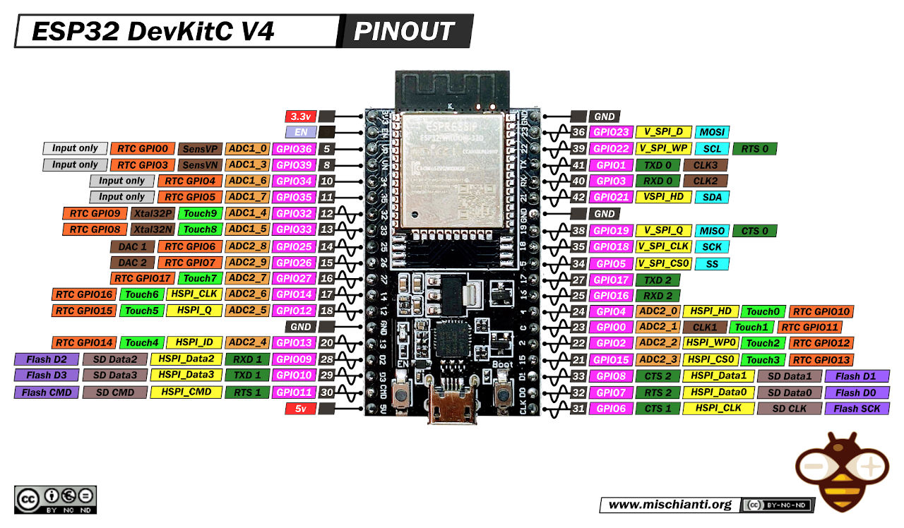

# MY PV ELWA ESPHome Adapter

ESPHome configuration file to setup a IR Hichi uart adapter to read data from MY PV ELWA IR interface
[Link to discussion](https://community.home-assistant.io/t/elwa-dc-read-uart-protocol-by-ir-hichi-with-esphome-how-to-get-into-separate-variables/652873)

## Installation

1. Install ESPHome (https://esphome.io/guides/installing_esphome.html)

2. Clone and enter this repo

```bash
git clone https://github.com/3x3cut0r/mypv_elwa_esphome.git
cd mypv_elwa_esphome
```

3. Create and edit your secrets.yaml

```bash
mv secrets.example.yaml secrets.yaml
```

To connect to Home Assistant or iobroker you need to generate either an API encryption key or enable MQTT settings in esphome.yaml

```bash
# generate API encryption key
# for Windows users, use this online tool: https://www.cryptool.org/en/cto/openssl/
openssl rand -base64 32
```

4. Validate your configuration

```bash
esphome config esphome.yaml
```

5. Connect your ESP32 to your computer via USB

6. Start ESPHome dashboard

```bash
esphome dashboard .
```

7. Open the dashboard in a web browser: http://localhost:6052/

8. Click on the 3 dots of the ONLINE showing esphome.yaml box -> Install -> Plug into this computer

9. Wait for `preparing download`

10. Click on `1. Download project` (the file may be marked as unsafe -> click on keep file anyway)

11. Click on `2. Open ESPHome Web`

12. Click on `CONNECT` -> choose your ESP32 on the list

13. Click on `INSTALL` -> choose your previously downloaded `firmware.factory.bin`

14. While holding the `BOOT` button on your device, click on `INSTALL` again

15. Wait for the installer to finish

16. Your ESP32 should now connect to your WiFi

17. Check your internet router to get the IP address of the device (device name is `esphome-web-e45ce4`)

18. Open the IP in a web browser, e.g., http://192.168.178.254

## Cabling



**Note: TX and RX are normally crossed, means that TX from the IR Hichi goes into RX from the ESP32 and vice versa. This was not the case for me. You may have to rotate the two pins to find out what works for you.**

| **IR Hichi** | **ESP32**    |
| ------------ | ------------ |
| TX           | GPIO 17 (TX) |
| RX           | GPIO 16 (RX) |
| GND          | GND          |
| VCC          | 5V           |
